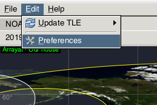
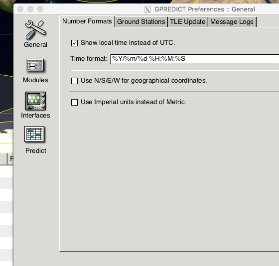
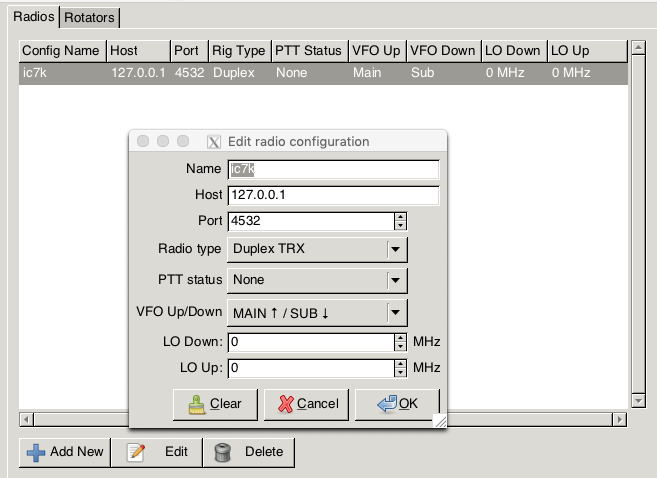
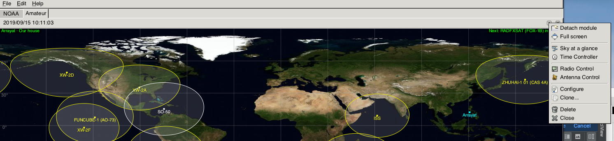
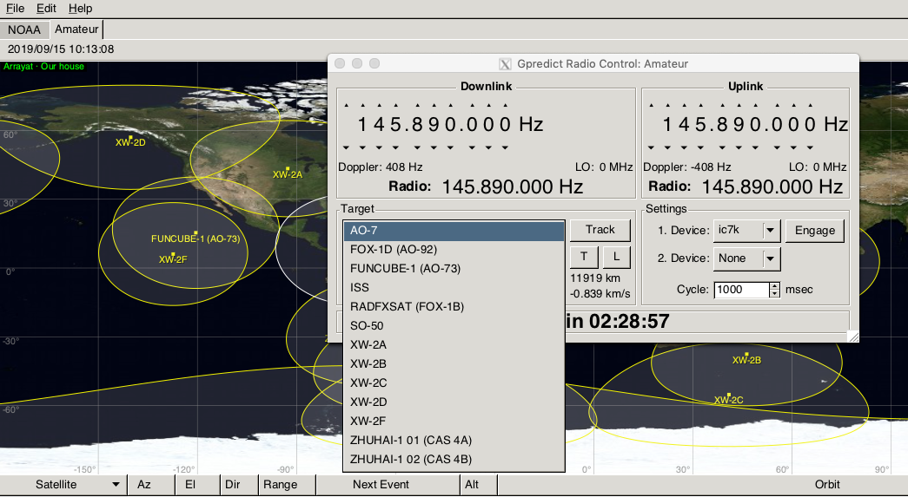
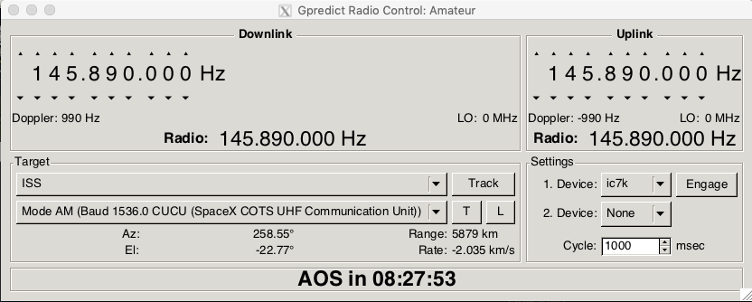

# Gpredict tracking

I am assuming that you have the following

  - Gpredict installed
  - Have generated and moved the TSP and MOD files to the correct place.
  - Restarted GPredict (I am not sure if it dynamically reads the directories)
  - Have a VHF/UHF Radio
  - Have it connected to the PC
  
  
 ## Verify we can talk to the Radio
 
 In GPredict goto 
 
    - Edit -> Preferences
    
 
 
 We now need to go to the Interfaces
 
 
 
 Here you can see I have added my IC7000  - but it is being accessed via a Network Socket (127.0.0.1).
 
 
 
 
 This means that I need to be running a RadioControl Daemon.
 
 So You need to check if this program is running on your machine (Mac, Linux)
 
     ps -ef | grep rigctl | grep -v grep
     
 If you see
 
 ```
```

Then nothing is running.


If you see something like
 
 ```bash
  501  2268  1989   0  9:50AM ttys002    0:00.01 rigctld
```

**rigctl is now running**.

### Setting up Rigctl

My Icom 7000 is model 360.

I know it is connected on a specific usb port.... 

And I have set the serial Speed to be the max on 19200 in the radio.

So with radio powered on, and connected.

So to manually connect to this radio I use this command.

    rigctl -m 360  -r /dev/cu.usbserial-FTDE0JY3 -s 19200
    
    
Simple test would be just to press "f"
It should show you the current radio's frequency.

#### Now use rigctrld 

Basically the same command

    rigctld -m 360  -r /dev/cu.usbserial-FTDE0JY3 -s 19200
    
Port by default is 5432, and your radio is accessable on either 127.0.0.1, or 192.1681.x, should you want to access it from a remote machine this is an IPAddress/Firewall problem rather than a rigctl issue.


So with rigctld running  - in a new terminal window issue this command

```bash
 echo "f" | nc -w 1 127.0.0.1 4532
```

This sends the "f" keystroke - to the rigctrld server, which (assuming it is connected) should return the frequency just as it did when we ran this in local connection mode.


### Auto Tracking 

We need rigctld running  - and assuming it is .... lets go and track the ISS.
For the moment it does not matter is it is overhead or not.

Open Radio Control



And then

Select the Satellite you wish to prepare to follow.



I will choose ISS.




We can now have the software calculate the Doppler offset, 
By Pressing the *TRACK* Button.

And you should see the numbers on the Software changing.

You can Pick which Transponder/Mode underneath - and the correct mode/freq should be selected.


At this point nothing is happening on your Radio .... 

#### Getting Radio to change frequency

On the right hand side of this screen  You have Device  - in my case is says *
*

To get the radio to track (even though the Sat may not in in AOS) just click the 
 **Engage** And now as is by magic the radio will track the calculated frequency for the satellite.

